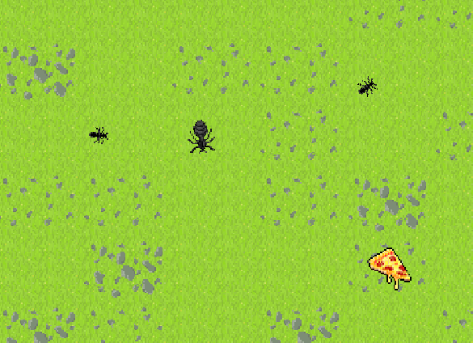
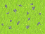
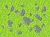

## Ant Pathfinding Demo
Inspired by all of the AI hype, I thought it would be fun to create a system that had the appearence of a very simple intelligence. 
There isn't an objective or goal, rather its a simple implementation of the A* pathfinding algorithm with a theme inspired by [Sim Ant](https://en.wikipedia.org/wiki/SimAnt).

#### Design
* Architecture influenced by [Cross-Platform Vector Shooter: XNA](https://gamedevelopment.tutsplus.com/series/cross-platform-vector-shooter-xna--gamedev-10559).
* Simple implementation of the [State Pattern](https://en.wikipedia.org/wiki/State_pattern).
* Pathfinding with the A* Algorithm using [Introduction to the A* Algorithm from Red Blob Games](https://www.redblobgames.com/pathfinding/a-star/introduction.html).

#### Technology
* [Raylib](https://github.com/raysan5/raylib) the game library 
* [libresprite](https://libresprite.github.io/#!/) for graphics and animations
* [ChatGPT](https://chat.openai.com/) to help with math

## Game
Play as a hungry queen ant on the quest for pizza. Spawn helper ants to feed the colony.

[Download win-x64](https://drive.google.com/file/d/1sPcffGf4f_4KQEgbnXgVjRreQyzWIBvq/view?usp=sharing) 5.8 MB

### Controls - Mouse only
* Left click: move
* Right click: spawn ant
* ScrollWheel: +/- zoom

### Environment 
*  Easy to traverse  
*  Rougher terrain
*  Impassable
